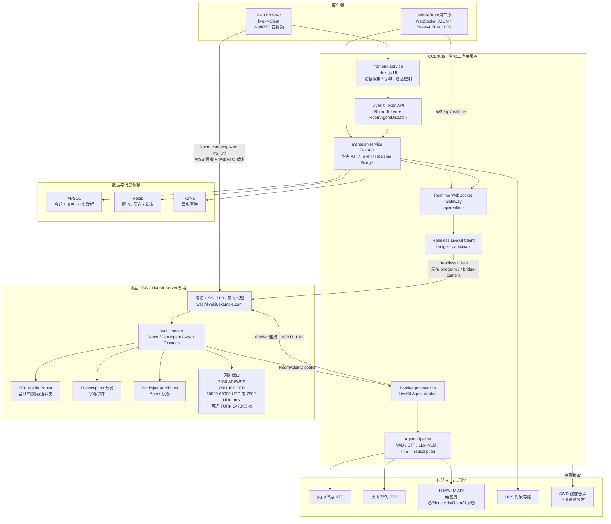
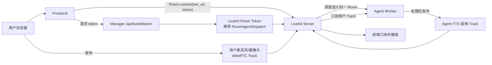
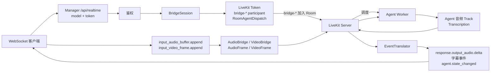
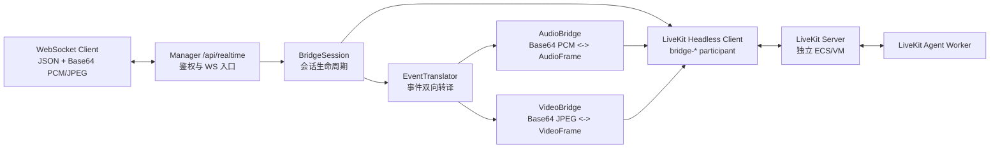
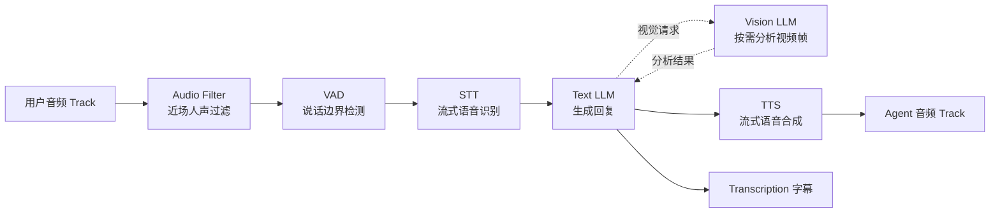
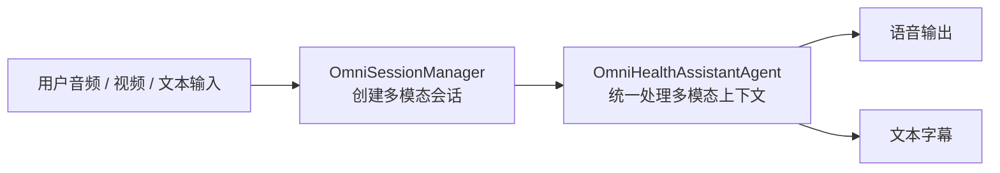
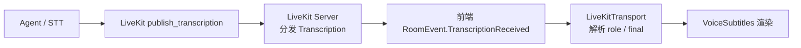
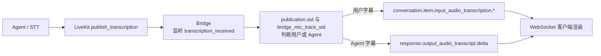

# 全双工架构设计

> 本文档描述基于 LiveKit 的全双工实时语音对话架构，覆盖部署边界、WebRTC 与 WebSocket 两种接入模式、Agent Pipeline、字幕系统和关键技术栈。

---

## 目录

- [1. 系统概览](#1-系统概览)
- [2. 项目目录结构](#2-项目目录结构)
- [3. 整体架构](#3-整体架构)
- [4. LiveKit Server 部署说明](#4-livekit-server-部署说明)
- [5. 协议模式对比](#5-协议模式对比)
- [6. WebRTC Pipeline 流程](#6-webrtc-pipeline-流程)
- [7. WebSocket Pipeline 流程](#7-websocket-pipeline-流程)
- [8. Agent 内部 Pipeline](#8-agent-内部-pipeline)
- [9. 字幕系统设计](#9-字幕系统设计)
- [10. 核心组件职责](#10-核心组件职责)
- [11. 技术栈](#11-技术栈)

---

## 1. 系统概览

全双工架构面向低延迟实时语音对话场景，核心目标是让用户语音输入、Agent 理解、模型推理、语音合成和字幕展示形成可打断、可持续的双向流式链路。

### 核心能力

| 能力             | 说明                                                         |
| ---------------- | ------------------------------------------------------------ |
| 实时语音对话     | 基于 LiveKit 的低延迟双向音视频通信，支持用户打断            |
| 语音识别 STT     | 火山引擎/华为云/自定义 STT 插件，支持流式识别                |
| 语音合成 TTS     | 火山引擎/华为云/自定义 TTS 插件，支持流式合成和音色配置      |
| 大模型推理       | 文本模型处理对话推理，视觉模型处理图像理解                   |
| 语音活动检测 VAD | Agent 侧进行说话/静音边界检测                                |
| 多模态交互       | WebRTC 视频轨道或 WebSocket 图片帧接入视觉分析               |
| 实时字幕         | 通过 LiveKit Transcription 统一发布用户转写和 Agent 回复字幕 |

---

## 2. 项目目录结构

项目按前端、主后端、语音 Agent、垂直服务、部署配置和测试文档划分。目录结构只列主要模块和职责。

```text
health-assistant/
├── frontend/                    # Next.js 前端应用
│   ├── app/                     # 页面路由，包含聊天、语音通话、登录等页面
│   ├── components/              # 通用 UI、语音可视化、字幕、视频预览等组件
│   ├── hooks/                   # 前端状态和设备能力相关 Hooks
│   └── lib/realtime/            # 实时通信 SDK：WebRTC Transport 与 WebSocket Transport
│
├── backend/
│   ├── manager/                 # FastAPI 主后端服务
│   │   ├── app/routers/         # 认证、聊天、上传、LiveKit token、Realtime WS 等 API
│   │   └── app/services/        # 业务服务、LLM 路由、文件存储、Realtime Bridge
│   │
│   ├── livekit_agent/           # LiveKit Agent Worker
│   │   ├── main.py              # AgentServer 入口和会话调度
│   │   ├── session_manager.py   # Pipeline 会话创建和生命周期管理
│   │   ├── omni_session_manager.py # Omni 会话创建和生命周期管理
│   │   ├── health_agent.py      # Pipeline 模式健康助手 Agent
│   │   ├── omni_agent.py        # Omni 多模态 Agent
│   │   ├── transcription.py     # 字幕发布服务
│   │   └── plugins/             # STT/TTS/LLM/VAD/Omni 插件适配
│   │
│   └── vertical_services/       # 垂直领域服务：皮肤诊断、智能药箱、病历解读
│
├── docker/                      # 本项目容器部署配置，不包含 livekit-server
├── docs/                        # 架构、接口、测试方案和集成文档
└── test/                        # 端到端测试和 WebSocket 测试客户端
```

### 主要模块职责

| 模块                        | 主要职责                                                                   |
| --------------------------- | -------------------------------------------------------------------------- |
| `frontend`                  | 提供聊天与通话 UI，采集麦克风/摄像头，维护字幕、Agent 状态和通话控制       |
| `backend/manager`           | 提供业务 API、鉴权、LiveKit token 签发、WebSocket Bridge、会话和文件管理   |
| `backend/livekit_agent`     | 作为 LiveKit Agent Worker 加入房间，执行 VAD、STT、LLM/VLM、TTS 和字幕发布 |
| `backend/vertical_services` | 提供皮肤、药品、病历等垂直领域能力，供主后端或模型链路调用                 |
| `docker`                    | 部署本项目应用服务及 MySQL/Redis/Kafka/Nginx 等依赖                        |
| `docs` / `test`             | 维护接口文档、架构说明、自动化测试方案和测试客户端                         |

---

## 3. 整体架构

LiveKit Server 是全双工音视频基础设施，生产环境部署在独立 ECS 上。Frontend、Manager 和 LiveKit Agent 作为应用服务部署在 CCE/K8s 集群中。本仓库不包含 `livekit-server` 项目。



### 数据流总览

| 路径             | 入口                                                | LiveKit 角色                               | 说明                                                |
| ---------------- | --------------------------------------------------- | ------------------------------------------ | --------------------------------------------------- |
| WebRTC 直连      | 前端调用 `/api/livekit/token` 后直连 LiveKit Server | 用户浏览器是 Room participant              | 音视频走 WebRTC Track，字幕和状态走 LiveKit 事件    |
| WebSocket Bridge | 客户端连接 Manager `/api/realtime`                  | Manager 以 Headless Client 加入 Room       | JSON/PCM/JPEG 由 Bridge 转换为 LiveKit Track 和事件 |
| Agent Worker     | Agent Worker 连接 LiveKit Server                    | Agent 被 `RoomAgentDispatch` 调度加入 Room | 统一处理来自 WebRTC 或 WebSocket Bridge 的媒体流    |

---

## 4. LiveKit Server 部署说明

### 部署边界

`livekit-server` 需要独立部署在 ECS 上，属于基础设施组件，不在本仓库目录结构和 `docker/compose.yaml` 中。Manager 和 Agent 通过配置指向该独立服务。

### 配置关系

| 组件            | 配置项                                                    | 作用                                                   |
| --------------- | --------------------------------------------------------- | ------------------------------------------------------ |
| Manager Service | `LIVEKIT_WS_URL`                                          | 返回给前端，并供 WebSocket Bridge 连接 LiveKit Server  |
| Manager Service | `LIVEKIT_API_KEYS` / `LIVEKIT_API_SECRETS`                | 签发 Room Token，支持 `prod/dev1/dev2/dev3` 多环境凭证 |
| Manager Service | `LIVEKIT_DEFAULT_TOKEN_MODE`                              | 前端未指定 `tokenMode` 时使用的默认凭证组              |
| Manager Service | `LIVEKIT_DEFAULT_AGENT_TYPE` / `LIVEKIT_AGENT_ENV_SUFFIX` | 拼接完整 Agent 注册名，用于 `RoomAgentDispatch`        |
| Agent Worker    | `LIVEKIT_URL`                                             | Agent Worker 连接的 LiveKit Server 地址                |
| Agent Worker    | `LIVEKIT_API_KEY` / `LIVEKIT_API_SECRET`                  | Agent Worker 向 LiveKit Server 注册和接收调度          |
| livekit-server  | `keys`                                                    | 必须与 Manager/Agent 使用的 API key/secret 保持一致    |

### 网络端口

| 端口                   | 用途                         | 部署说明                                                |
| ---------------------- | ---------------------------- | ------------------------------------------------------- |
| `7880`                 | LiveKit API / WebSocket 信令 | 通常通过域名、SSL 和 WSS 暴露给客户端、Manager 和 Agent |
| `7881`                 | ICE TCP fallback             | 弱网或 UDP 不可用时使用                                 |
| `50000-60000/udp`      | WebRTC UDP 媒体端口范围      | 默认媒体端口范围，需在安全组放通                        |
| `7882/udp`             | UDP mux                      | 可替代大范围 UDP 端口，按部署配置选择                   |
| `3478/udp`、`5349/tcp` | TURN / TURN TLS              | 可选，跨 NAT 或企业网络环境建议部署                     |

> 端口以 LiveKit 官方自托管部署文档为准：  
> <https://docs.livekit.io/home/self-hosting/deployment/>  
> <https://docs.livekit.io/transport/self-hosting/ports-firewall/>

---

## 5. 协议模式对比

系统提供 WebRTC 与 WebSocket 两种实时接入方式。两条链路最终都会进入同一个 LiveKit Room，Agent 看到的都是标准 LiveKit 音视频轨道和事件。

| 特性        | WebRTC Pipeline                       | WebSocket Pipeline                          |
| ----------- | ------------------------------------- | ------------------------------------------- |
| 适用场景    | 浏览器、移动端、低延迟通话            | 第三方接入、服务端脚本、IoT、小程序兼容场景 |
| 客户端协议  | LiveKit Client SDK                    | WebSocket JSON 事件                         |
| 音频传输    | WebRTC Media Track，Opus 编码         | Base64 PCM，默认 `pcm16` 输入、`pcm24` 输出 |
| 视频传输    | WebRTC Camera Track                   | Base64 JPEG 帧                              |
| 服务端入口  | `/api/livekit/token` + LiveKit Server | Manager `/api/realtime`                     |
| Bridge 开销 | 无                                    | 有，Manager 需要做协议和媒体转换            |
| 字幕通道    | LiveKit `TranscriptionReceived`       | Bridge 转换为 Realtime 风格字幕事件         |
| 推荐用途    | 主力实时语音体验                      | 外部集成和无法直接使用 WebRTC SDK 的客户端  |

---

## 6. WebRTC Pipeline 流程

### 连接与媒体流



### 关键模块

| 代码路径                                            | 功能和作用                                                                                 |
| --------------------------------------------------- | ------------------------------------------------------------------------------------------ |
| `frontend/lib/realtime/livekit-transport.ts`        | 封装 LiveKit Room 连接、麦克风/摄像头发布、Agent 音频播放、字幕和状态事件监听              |
| `frontend/lib/realtime/hooks/useRealtimeSession.ts` | 将 Transport 事件映射为 React 状态，供通话页面使用                                         |
| `backend/manager/app/routers/livekit.py`            | 校验 `tokenMode` / `agentName`，签发 LiveKit Room Token，并写入 `RoomAgentDispatch` 元数据 |
| `backend/livekit_agent/main.py`                     | 注册 Agent Worker，收到调度后连接 Room 并启动 Pipeline 或 Omni 会话                        |

### WebRTC 事件

| 事件来源              | 事件                                            | 用途                                          |
| --------------------- | ----------------------------------------------- | --------------------------------------------- |
| LiveKit Track         | `TrackSubscribed`                               | 前端订阅 Agent 音频并播放                     |
| LiveKit Transcription | `TranscriptionReceived`                         | 前端接收用户和 Agent 字幕                     |
| ParticipantAttributes | `lk.agent.state`                                | 驱动 `listening/thinking/speaking` 等 UI 状态 |
| LiveKit Connection    | `Reconnecting` / `Reconnected` / `Disconnected` | 驱动连接状态和异常提示                        |

---

## 7. WebSocket Pipeline 流程

WebSocket 模式面向不能直接使用 LiveKit SDK 的客户端。Manager 在内部创建 `BridgeSession`，以 Headless LiveKit Client 身份加入 Room，把 WebSocket 事件转换为 LiveKit 媒体流和事件。

### 连接与媒体流



### Bridge 架构



### 关键模块

| 代码路径                                                    | 功能和作用                                                                             |
| ----------------------------------------------------------- | -------------------------------------------------------------------------------------- |
| `backend/manager/app/routers/realtime.py`                   | 提供 WebSocket 入口，支持 Header 或 query token 鉴权                                   |
| `backend/manager/app/services/realtime/bridge_session.py`   | 管理 WS 会话生命周期，创建 LiveKit Room 连接，发布 `bridge-mic` 和可选 `bridge-camera` |
| `backend/manager/app/services/realtime/event_translator.py` | 转译客户端事件、监听 Agent 音频 Track、监听转录和状态事件并推送 WS JSON                |
| `backend/manager/app/services/realtime/audio_bridge.py`     | 在 Base64 PCM 和 LiveKit AudioFrame 之间转换                                           |
| `backend/manager/app/services/realtime/video_bridge.py`     | 在 Base64 JPEG 帧和 LiveKit VideoFrame 之间转换                                        |

### WebSocket 事件

| 方向             | 事件                                                       | 作用                                     |
| ---------------- | ---------------------------------------------------------- | ---------------------------------------- |
| Client -> Server | `session.update`                                           | 更新指令、场景、音色、音频格式等会话配置 |
| Client -> Server | `input_audio_buffer.append`                                | 推送 Base64 PCM 音频                     |
| Client -> Server | `input_video_frame.append`                                 | 推送 Base64 JPEG 视频帧                  |
| Client -> Server | `response.cancel`                                          | 请求打断当前 Agent 回复                  |
| Server -> Client | `session.created` / `session.updated`                      | 通知会话创建和配置更新                   |
| Server -> Client | `conversation.item.input_audio_transcription.*`            | 用户语音转写字幕                         |
| Server -> Client | `response.output_audio.delta`                              | Agent 音频 PCM 增量                      |
| Server -> Client | `response.output_audio_transcript.delta` / `response.done` | Agent 回复字幕和回复结束                 |
| Server -> Client | `agent.state_changed`                                      | Agent 状态变化                           |

---

## 8. Agent 内部 Pipeline

Agent Worker 通过 LiveKit Agents 框架运行。无论客户端来自 WebRTC 还是 WebSocket Bridge，Agent 接收到的都是同一个 Room 中的音频/视频 Track。

### Pipeline 模式



### Omni 模式



### 关键能力

| 能力                 | 说明                                                         |
| -------------------- | ------------------------------------------------------------ |
| Pipeline / Omni 切换 | 通过 `PIPELINE_MODE` 选择传统流水线或 Omni 多模态模式        |
| 双模型路由           | 文本对话走 Text LLM，视觉请求走 Vision LLM                   |
| 视觉能力             | 支持摄像头帧缓存、清晰度选帧、视觉意图预判和 VLM 预分析      |
| 打断处理             | 用户说话或客户端取消时停止当前回复，回到监听状态             |
| 字幕发布             | 统一通过 LiveKit Transcription 发布用户转写和 Agent 回复文本 |

---

## 9. 字幕系统设计

字幕系统以 LiveKit Transcription 为统一源头。Agent 发布转录后，WebRTC 前端直接接收 LiveKit 事件，WebSocket Bridge 则把事件转换为 Realtime 风格 JSON。

### 字幕来源

| 来源         | 内容                        | 发布方式                             |
| ------------ | --------------------------- | ------------------------------------ |
| STT          | 用户语音识别结果            | Agent/LiveKit 会话转录事件           |
| TTS 输入文本 | Agent 回复文本              | `TranscriptionService` 发布          |
| VLM 分析结果 | 图像分析过程和结果          | 作为 Agent 回复字幕发布              |
| Agent 状态   | listening/thinking/speaking | ParticipantAttributes 或 Bridge 事件 |

### WebRTC 字幕流



### WebSocket 字幕流



### 字幕事件对比

| 协议      | 用户字幕                                                      | Agent 字幕                                                 | 状态                  |
| --------- | ------------------------------------------------------------- | ---------------------------------------------------------- | --------------------- |
| WebRTC    | `TranscriptionReceived`，role 为用户                          | `TranscriptionReceived`，role 为 assistant                 | `lk.agent.state`      |
| WebSocket | `conversation.item.input_audio_transcription.delta/completed` | `response.output_audio_transcript.delta` + `response.done` | `agent.state_changed` |

---

## 10. 核心组件职责

### 前端实时通信

| 组件               | 职责                                                    |
| ------------------ | ------------------------------------------------------- |
| `LiveKitTransport` | WebRTC 连接、Track 发布/订阅、字幕和 Agent 状态事件聚合 |
| `WsTransport`      | WebSocket Realtime 风格事件接入、PCM 采集和播放         |
| `VoiceSubtitles`   | 展示用户和 Agent 实时字幕，处理 interim/final 文本      |
| `VoiceVisualizer`  | 根据音量和 Agent 状态展示语音动效                       |
| `VideoPreview`     | 管理本地摄像头预览、前后摄切换和视频模式 UI             |

### Manager Service

| 组件                          | 职责                                                    |
| ----------------------------- | ------------------------------------------------------- |
| `livekit.py`                  | 生成 LiveKit Room Token，携带 Agent 调度配置            |
| `realtime.py`                 | WebSocket 入口和鉴权                                    |
| `BridgeSession`               | 管理 WebSocket 会话、LiveKit Headless Client 和资源清理 |
| `EventTranslator`             | 转换 Realtime JSON 事件与 LiveKit Room 事件             |
| `AudioBridge` / `VideoBridge` | 完成音频/视频格式转换                                   |

### LiveKit Agent Worker

| 组件                   | 职责                                          |
| ---------------------- | --------------------------------------------- |
| `main.py`              | 注册 AgentServer、预热 VAD、接收 LiveKit 调度 |
| `SessionManager`       | 创建 Pipeline 模式会话、STT/TTS/LLM/VLM 实例  |
| `OmniSessionManager`   | 创建 Omni 多模态会话                          |
| `HealthAssistantAgent` | 执行健康助手业务逻辑、视觉工具调用、对话路由  |
| `TranscriptionService` | 发布 Agent 回复、VLM 状态和最终字幕           |
| `plugins/`             | 适配 STT、TTS、LLM、VAD 和 Omni 提供商        |

---

## 11. 技术栈

本章节只列全双工对话主链路中的关键技术和库。

### 实时音视频与 LiveKit

| 技术                 | 说明                                                                                               |
| -------------------- | -------------------------------------------------------------------------------------------------- |
| `livekit-server`     | 独立 ECS 部署的实时音视频 SFU，负责 Room、Participant、Track、Agent Dispatch 和 Transcription 分发 |
| `livekit-client`     | 前端 WebRTC Room 连接、麦克风/摄像头 Track 发布、Agent 音频订阅和 LiveKit 事件监听                 |
| `livekit-api`        | Manager 签发 Room Token，并写入 `RoomAgentDispatch` 配置                                           |
| `livekit` Python SDK | Manager WebSocket Bridge 以 Headless Client 身份加入 Room，发布和订阅音视频 Track                  |
| LiveKit RTC          | Agent 与 Bridge 使用的 Room、AudioFrame、VideoFrame、Transcription 和 ParticipantAttributes 能力   |

### 前端全双工接入

| 技术                         | 说明                                                                      |
| ---------------------------- | ------------------------------------------------------------------------- |
| WebRTC / MediaStream         | 浏览器采集麦克风和摄像头，通过 LiveKit Track 进行低延迟双向媒体传输       |
| Web Audio API / AudioContext | 音频采集、播放、音量分析和噪声门处理                                      |
| WebSocket API                | WebSocket Pipeline 的实时 JSON 事件、Base64 PCM 音频和图片帧传输          |
| PCM / Opus                   | WebSocket 链路使用 PCM，WebRTC 链路由 LiveKit/WebRTC 处理 Opus 等媒体编码 |
| React / TypeScript           | 通话状态、字幕状态、设备控制和实时事件绑定                                |

### Manager Realtime Bridge

| 技术                      | 说明                                                                                 |
| ------------------------- | ------------------------------------------------------------------------------------ |
| FastAPI WebSocket         | 对外提供 `/api/realtime`，承载 Realtime 风格双向事件协议                             |
| Headless LiveKit Client   | Manager 作为 `bridge-*` participant 加入 LiveKit Room，连接 WebSocket 客户端与 Agent |
| AudioBridge / VideoBridge | 在 Base64 PCM/JPEG 与 LiveKit `AudioFrame` / `VideoFrame` 之间转换                   |
| EventTranslator           | 转译客户端事件、LiveKit Track、Transcription 和 Agent 状态                           |
| MySQL / Redis / Kafka     | 支撑鉴权、会话、缓存、限流和异步事件，不参与媒体转发                                 |

### LiveKit Agent Pipeline

| 技术                                          | 说明                                                          |
| --------------------------------------------- | ------------------------------------------------------------- |
| `livekit-agents[silero,turn-detector]~=1.3.0` | Agent Worker 框架，负责任务调度、会话生命周期和 Pipeline 编排 |
| Silero VAD / TEN VAD                          | 语音活动检测和端点判断，支持用户打断                          |
| `livekit-plugins-openai`                      | OpenAI 兼容 LLM/VLM 接入，用于文本推理和视觉理解              |
| `livekit-plugins-volcengine`                  | 火山引擎语音能力插件接入                                      |
| 自定义 STT/TTS 插件                           | 适配火山、华为云和自定义 WebSocket 语音服务                   |
| TranscriptionService                          | 统一发布用户转写、Agent 回复和 VLM 分析字幕                   |

### 流式语音与模型服务

| 技术                    | 说明                                         |
| ----------------------- | -------------------------------------------- |
| 火山/华为 STT           | 流式语音识别，将用户音频转为文本             |
| 火山/华为 TTS           | 流式语音合成，将 Agent 回复转为可播放音频    |
| OpenAI 兼容 LLM/VLM API | 支持文本对话、视觉分析和多模态推理           |
| Omni 多模态链路         | 在 Omni 模式下统一处理音频、视频和文本上下文 |
| OBS 对象存储            | 保存图片、文件和通话相关资源引用             |

---

_文档版本: 1.1.0_  
_最后更新: 2026-04-28_
